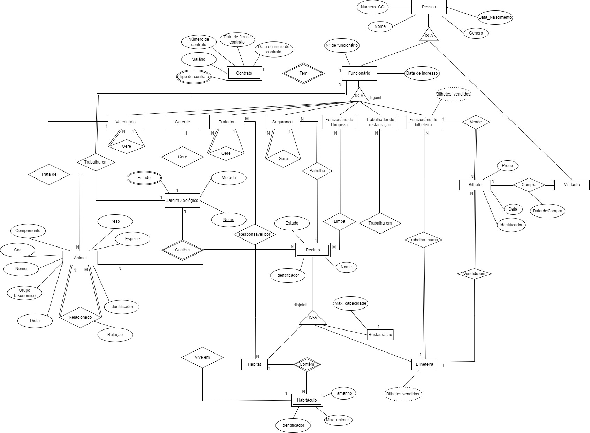
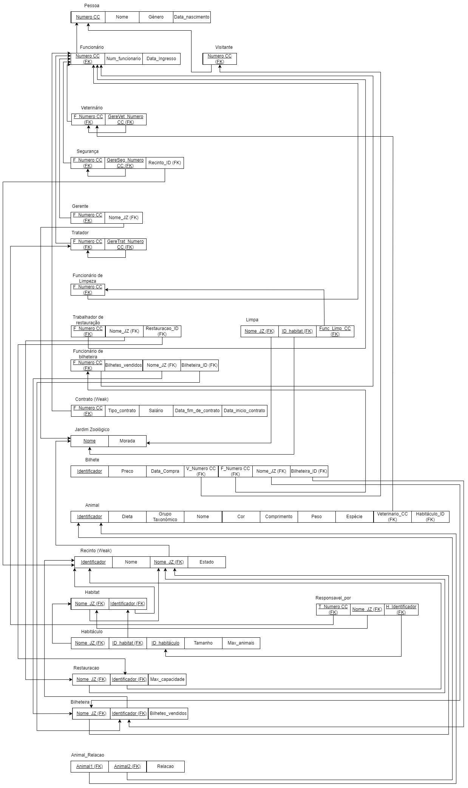

# BD: Trabalho Prático APFE

**Grupo**: P8G5
- Rodrigo Abreu, MEC: 113626
- Ricardo, MEC: 115243

## Introdução / Introduction
 
Esta base de dados destina-se a utilização por administradores de Jardins Zoológicos para consulta e manipulação de dados. Pode ser utilizado para análise de dados ou para manter um lugar onde toda a informação está atualizada de forma organizada. 

Com este programa, será fácil efetuar operações como colocar um animal num habitáculo que não esteja preenchido, consultar os dados de salário de um trabalhador, ou consultar os bilhetes vendidos num certo dia.

## ​Análise de Requisitos / Requirements

#### Utilizador (Analista de dados)

<li>Acesso a informação sobre cada jardim zoológico.</li>
<li>Acesso a informação sobre cada animal</li>
<li>Acesso a informação sobre clientes.</li>
<li>Acesso a informação sobre o resultado das bilheteiras.</li>
<li>Acesso a informação sobre os respetivos funcionários da empresa.</li>
<li>Acesso a informação sobre cada recinto.</li>

#### Administrador

<li>Gerir o registo dos jardins zoológicos no sistema (inserções, remoções, etc)
<li>Gerir o registo dos animais no sistema (inserções, remoções, etc)
<li>Gerir o registo dos funcionários no sistema (inserções, remoções, etc)
<li>Gerir o registo dos recintos no sistema (inserções, remoções, etc)
<li>Registar novos clientes.

## DER

## ER

